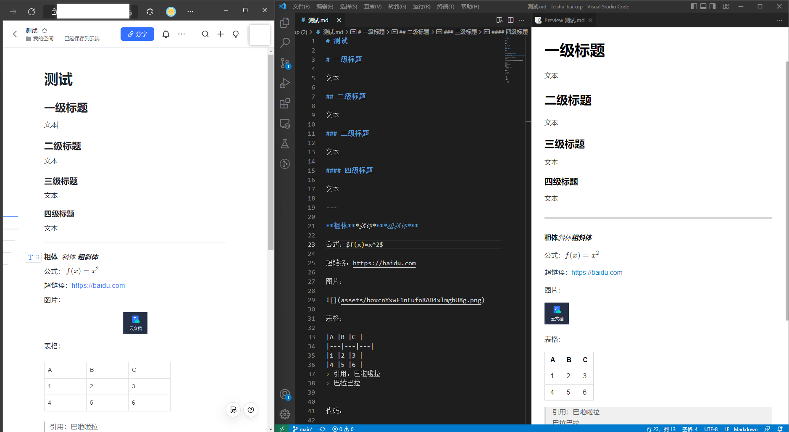
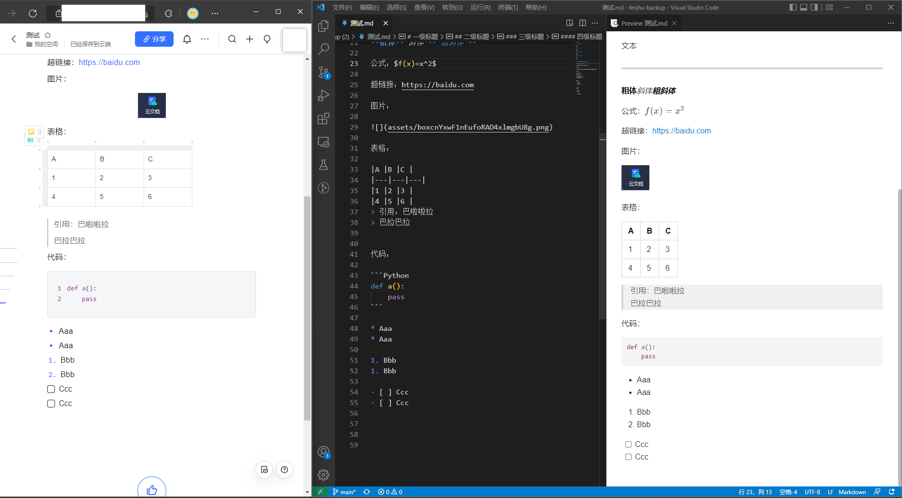

# 飞书云文档备份

用于备份下载所有飞书云文档。文档将被转换成markdown。


## 快速使用
> 本应用为了简单化、不搞后端服务，因此直接利用APP ID和Secret进行授权，这（几乎）是明文的，因此有安全风险，请不要让无关人员知道你的备份URL！
> 如果你追求安全，应该搞一个后端专门负责授权。
> 另外，本应用针对个人用户设计，因为你需要创建飞书应用并申请权限，如果想把公司离职前写的文档搬走恐怕不太可行！

### 零、创建应用
在[飞书开放平台](https://open.feishu.cn)创建一个企业应用，名字随便写。在应用后台的权限管理中找到云文档相关的权限，都点上。然后发布版本，自己审核自己，应用上线。

### 一、配置
访问[https://dicarne.github.io/feishu-backup/#/config](https://dicarne.github.io/feishu-backup/#/config)，填写App ID和App Secret（这些能在应用的凭证管理中找到），然后点击计算按钮。

将生成的`重定向URL`复制粘贴到你创建的应用的安全设置-重定向URL中。

### 二、完成！
接下来保存下面的`备份URL`，以后你直接访问这个链接即可打开并授权备份应用。

### 三、简单使用说明
配置好以后，打开备份URL，有两个按钮：备份`下载云空间文档`和`下载知识库文档`，分别是针对云空间和知识空间的备份。

#### 下载云空间文档
点击`选择文件`，选择你需要的文件，再点击`下载选中文件`即可。
或者`下载所有文件`，会遍历整个云空间下载。

#### 下载知识库文档
将会出现知识库列表，当前仅支持下载整个知识库中的所有文档，

### QA
#### 为什么只能下载一部分云文档
目前只支持`doc`和`docx`的下载。其他的文件、表格都不支持，请考虑手动导出。云文档下载后将会被转换成markdown，图片将被放在文档同级目录。

#### 为什么文档中只有一部分内容
文档内不支持转换成markdown的块不会被导出，它们会消失。有些是我没有实现转换的功能，有些是飞书不支持导出。

在导出markdown时将会顺便导出一份JSON，这是飞书返回的原始数据，你可以自己写脚本处理它。

#### 为什么排版与格式感觉不对
markdown不能很好的支持所有富文本元素，例如多列布局等。虽然也有奇淫技巧可以在markdown中实现，但鉴于通用性，暂时不考虑（或者等研究出一个漂亮的方案）。

很多文本样式在markdown中不能很好的支持。

## 预览

左侧是飞书文档，中间是导出的markdown，右侧是渲染后的markdown。





## 高级
> 下面是部署原理，自己部署的话需要看懂，如果你只是想简单的使用，就跳过本节

### 计算飞书URL
记住`app_id`和`app_secret`，构造url: `https://{{your_server}}/tool/feishu-backup/#/backup/{{app_id}}/{{app_secret}}`。在飞书应用后台的安全设置中的重定向中写入这个url。

把这个url encode后，作为`{{your_direct_url}}`。

启动备份的URL：中间需要替换你自己的重定向URL和APP_ID
`https://open.feishu.cn/open-apis/authen/v1/index?redirect_uri={{your_direct_url}}&app_id={{app_id}}`

打开这个链接，然后授权，点击按钮，等待下载。

### 部署
#### 1. 准备
```
git clone https://github.com/dicarne/feishu-backup.git
pnpm i
```

#### 2. 修改base url
修改`.env`中的`VITE_BASEURL`，改成你需要的路径。这跟你的Nginx之类的网页服务器的配置有关。形如`https://your.domain/AAA/BBB/CCC/#/...`中的`/AAA/BBB/CCC`就是base url。如果不需要的话，简单改成`/`应该就行了。

#### 3. 创建secret.ts
这是用于声明你的API转发URL，需要支持CORS。之所以需要转发，就是因为要避免跨域的问题。可以在配置Nginx的时候顺便写了，简单地转发请求的一切内容即可。`baseUrl`需要Auth头，`baseUrl_noauth`不需要Auth头，这在某些情况下有用，如果你用Nginx转发的话，两个都写一样就好了。

`/secret.ts`内容如下：
```
import { Secret } from './secret_interface'
export default {
    baseUrl: "http://your.domain/YOUR_URL",
    baseUrl_noauth: "http://your.domain/YOUR_URL"
} as Secret
```

#### 4. 打包
`pnpm run build`，打包文件在`/dist`目录下，复制到你的静态网页文件夹中。

别忘了配置你的Nginx！Nginx需要为你的静态网页提供服务，也需要配置`proxy_pass`来转发请求！

配置网页的Nginx例子：
```
location /your_base_url/ {
                alias /web/feishu-backup/;  # 你的静态网页路径
                index index.html;
        }
```

配置转发的Nginx例子：
```
location /your_url {
                add_header Access-Control-Allow-Origin *;
                add_header Access-Control-Allow-Methods 'GET, POST, OPTIONS';
                add_header Access-Control-Allow-Headers 'DNT,X-Mx-ReqToken,Keep-Alive,User-Agent,X-Requested-With,If-Modified-Since,Cache-Control,Content-Type,Authorization';
                if ($request_method = 'OPTIONS') {
                        return 204;
                }
                proxy_pass https://open.feishu.cn/open-apis;
        }
```

## TODO
暂时只支持部分我需要的格式转换，所以很多格式都是跳过的。
可以修改`src/components/converter.ts`（飞书1.0doc）和`src/components/convert_docx.ts`（飞书2.0docx）支持你想要的块。

## 注意
这是为个人用户设计，你必须要有飞书的管理员权限才行。否则API无法获取你的文档。
注意，URL可能泄露你的app secret，请在可信的环境使用。

## 更新
- 支持飞书2.0 docx（不完全）
  - 多级标题
  - 加粗、斜体
  - 代码块
  - 公式块
  - 引用
  - 图片
- 增加一个看得过去的ui界面。
- 知识库已支持。

## 支持内容
### docx
| 类型        | 描述                                | 支持     |
| ----------- | ----------------------------------- | -------- |
| page        | 文档 Block，是整个文档树的根节点    | 支持     |
| text        | 文本 Block                          | 支持     |
| headingN    | 标题 Block，headingN，N 取值范围1~9 | 支持     |
| bullet      | 无序列表 Block                      | 支持     |
| ordered     | 有序列表 Block                      | 支持     |
| code        | 代码块 Block                        | 支持     |
| quote       | 引用 Block                          | 支持     |
| equation    | 公式 Block                          | 支持     |
| todo        | 任务 Block                          | 支持     |
| bitable     | 多维表格 Block                      |
| callout     | 高亮块 Block                        |
| chat_card   | 会话卡片 Block                      |
| diagram     | UML 图 Block                        |
| divider     | 分割线 Block                        | 支持     |
| file        | 文件 Block                          | 支持     |
| grid        | 分栏 Block                          | 部分支持 |
| grid_column | 分栏列 Block                        | 部分支持 |
| iframe      | 内嵌 Block                          |
| image       | 图片 Block                          | 支持     |
| isv         | 三方 Block                          |
| mindnote    | 思维笔记 Block                      |
| sheet       | 电子表格 Block                      |
| table       | 表格 Block                          | 支持，但不能合并
| table_cell  | 单元格 Block                        | 支持
| view        | 视图 Block                          |
|             | 网页卡片                            | 不支持